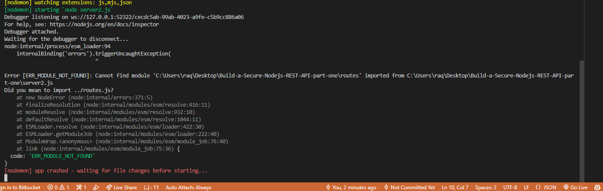

# Here's an image of an Error

## Error 1

Error 1 that may cause you trouble when adding **type models** in package.json.

### package.json

    "type": "module",

    "start":  "nodemon **--experimental-modules --es-module-specifier-resolution=node** server.js"
    should be used.

